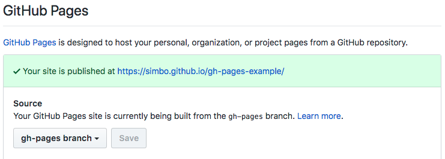

gh-pages-example
================

  > Example project for creating and maintaining github pages

---

<!-- TOC -->

- [Goals of this project](#goals-of-this-project)
- [Setup](#setup)
  - [Preconditions](#preconditions)
  - [Configure repository and GitHub](#configure-repository-and-github)

<!-- /TOC -->

---


## Goals of this project

Find and document a clean and convenient strategy to create and maintain a
github pages project where sources and generated contents are separate
branches.

Publishing updated contents should be handled in a way that is easy to
use and understand - preferably by just pushing updated sources to master and
letting travis build and deploy contents.


## Setup


### Preconditions

You have just created your new website project and your project root looks
something like this:

```
./
├─ dist/          # generated contents
├─ src/           # sources and templates
├─ .gitignore     # `dist/` folder is ignored
├─ package.json   # project metadata and tasks
└─ README.md      # project information
```


### Configure repository and GitHub

``` sh
# initialize git
git init

# go to github, create the remote repository and add it locally
git remote add origin git@github.com:simbo/gh-pages-example.git

# commit everything except the `dist/` folder, which is added to `.gitignore`
git add src .gitignore package.json README.md
git commit -m "initial commit"

# push master to github
git push origin master

# create a new orphan branch `gh-pages` and clear the working tree
git checkout --orphan gh-pages
git rm -rf .

# create an `index.html` and add it to git
echo "Hello World" > index.html
git add index.html
git commit -m "initial content"

# push `gh-pages` branch to github
git push origin gh-pages

# switch back to master branch
git checkout master
```

Go to repository settings on GitHub and check the *GitHub Pages* section.

Your branch `gh-pages` should be used as source and your content should then be
published at an URL like this: [simbo.github.io/gh-pages-example](https://simbo.github.io/gh-pages-example/)


